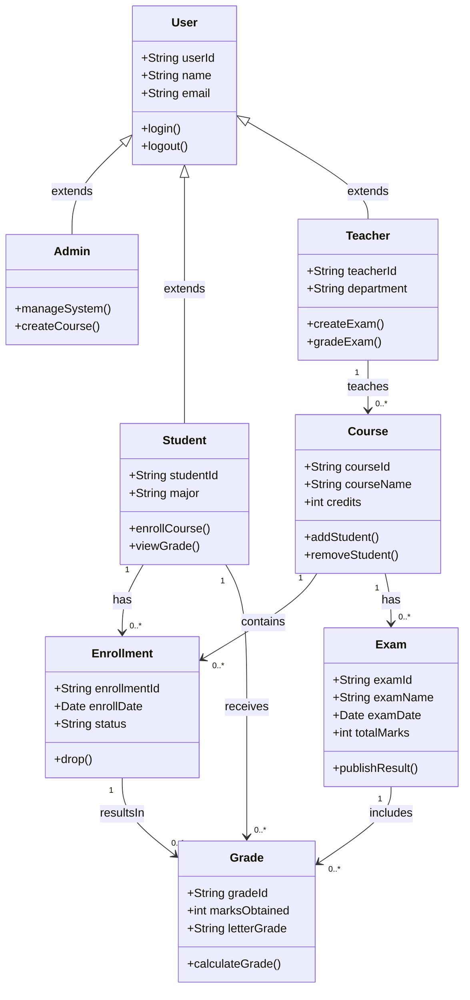

# 领域模型

**步骤**: 4/6
**状态**: completed
**自检**: 未检查

---

## Mermaid 类图

## 类关系

- **undefined** inheritance **undefined**
- **undefined** inheritance **undefined**
- **undefined** inheritance **undefined**
- **Student** association **Enrollment**
- **Course** association **Enrollment**
- **Teacher** association **Course**
- **Course** aggregation **Exam**
- **Exam** composition **Grade**
- **Student** association **Grade**
- **Enrollment** association **Grade**

