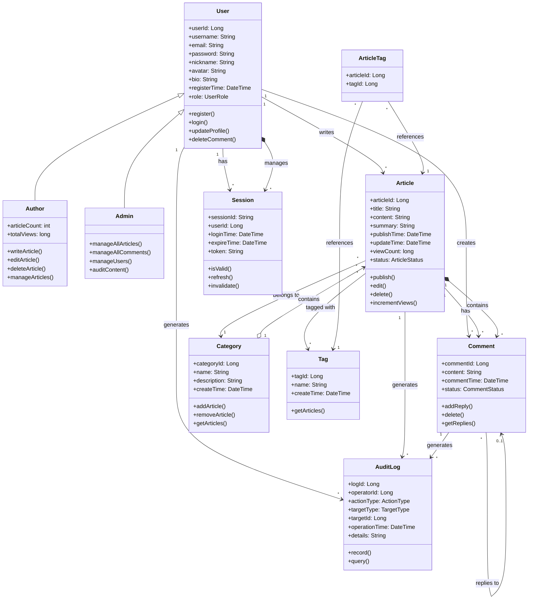

# 领域模型

**步骤**: 4/6
**状态**: completed
**自检**: 未检查

---

**描述**: 领域模型包含8个核心类，通过继承、关联、聚合和组合关系构建完整的博客系统领域模型。User作为基类派生出Author和Admin，Article与Comment、Category、Tag之间存在多种关联关系，同时通过AuditLog实现操作审计。多重性约束确保了数据完整性和业务规则的实现。

## Mermaid 类图

## 类关系

- **undefined** 泛化（继承） **undefined**
- **undefined** 关联 **undefined**
- **undefined** 聚合 **undefined**
- **undefined** 组合 **undefined**

