# 设计类图

**步骤**: 6/6
**状态**: completed
**自检**: 未检查

---

**设计摘要**: 设计类图在领域模型基础上进行了详细设计细化，主要改进包括：1) 补充了每个类的完整方法签名，包含参数和返回类型；2) 添加了属性和方法的可见性修饰符（public/private/protected）；3) 完善了类之间的关系，增加了依赖关系（Service层对Repository层的依赖）；4) 引入了设计模式，如Repository接口和泛型；5) 增加了Service层类（ArticleService、CommentService、UserService）来封装业务逻辑；6) 补充了数据访问层接口（ArticleRepository、CommentRepository、UserRepository）实现持久化操作。整体设计遵循分层架构原则，实现了关注点分离和可维护性。

## Mermaid 设计类图

```mermaid
classDiagram
    class User {
        -userId: Long
        -username: String
        -email: String
        -passwordHash: String
        -nickname: String
        -avatar: String
        -bio: String
        -registerTime: DateTime
        -role: UserRole
        -status: UserStatus
        -lastLoginTime: DateTime
        +register(username, email, password): boolean
        +login(usernameOrEmail, password): Session
        +updateProfile(nickname, avatar, bio): boolean
        +changePassword(oldPassword, newPassword): boolean
        +getArticles(): List~Article~
        +getComments(): List~Comment~
        #hashPassword(password): String
        #validatePassword(password): boolean
    }

    class Author {
        -articleCount: int
        -totalViews: long
        +writeArticle(title, content, categoryId, tags): Article
        +editArticle(articleId, title, content, categoryId, tags): boolean
        +deleteArticle(articleId): boolean
        +getMyArticles(status): List~Article~
        +getArticleStats(): ArticleStats
    }

    class Admin {
        -permissions: List~Permission~
        +manageAllArticles(): List~Article~
        +manageAllComments(): List~Comment~
        +manageUsers(): List~User~
        +auditArticle(articleId, approved, reason): boolean
        +auditComment(commentId, approved, reason): boolean
        +disableUser(userId): boolean
        +enableUser(userId): boolean
        +deleteUser(userId): boolean
        +getSystemStats(): SystemStats
    }

    class Article {
        -articleId: Long
        -title: String
        -content: String
        -summary: String
        -publishTime: DateTime
        -updateTime: DateTime
        -viewCount: long
        -status: ArticleStatus
        -isTop: boolean
        -allowComment: boolean
        +publish(): boolean
        +edit(title, content, categoryId, tags): boolean
        +delete(): boolean
        +incrementViews(): void
        +toggleTop(): boolean
        +getComments(): List~Comment~
        +getTags(): List~Tag~
        #generateSummary(content): String
        -validateContent(): boolean
    }

    class Comment {
        -commentId: Long
        -content: String
        -commentTime: DateTime
        -status: CommentStatus
        -depth: int
        +addReply(content, userId): Comment
        +delete(): boolean
        +getReplies(): List~Comment~
        +getParentComment(): Comment
        #validateContent(): boolean
    }

    class Category {
        -categoryId: Long
        -name: String
        -description: String
        -createTime: DateTime
        -articleCount: int
        -sortOrder: int
        +create(name, description): Category
        +update(name, description): boolean
        +delete(): boolean
        +getArticles(page, size): Page~Article~
        +getArticleCount(): int
    }

    class Tag {
        -tagId: Long
        -name: String
        -createTime: DateTime
        -articleCount: int
        +create(name): Tag
        +delete(): boolean
        +getArticles(page, size): Page~Article~
        +getArticleCount(): int
        +mergeTo(targetTagId): boolean
    }

    class ArticleTag {
        -articleId: Long
        -tagId: Long
        +addTag(articleId, tagId): boolean
        +removeTag(articleId, tagId): boolean
        +getTagsByArticle(articleId): List~Tag~
        +getArticlesByTag(tagId): List~Article~
    }

    class Session {
        -sessionId: String
        -userId: Long
        -loginTime: DateTime
        -expireTime: DateTime
        -lastAccessTime: DateTime
        -token: String
        -ipAddress: String
        -userAgent: String
        +isValid(): boolean
        +refresh(): boolean
        +invalidate(): boolean
        +extendExpiry(minutes): boolean
        #generateToken(): String
    }

    class AuditLog {
        -logId: Long
        -operatorId: Long
        -actionType: ActionType
        -targetType: TargetType
        -targetId: Long
        -operationTime: DateTime
        -details: String
        -ipAddress: String
        +record(action, target, details): boolean
        +query(criteria): List~AuditLog~
        +getLogsByUser(userId): List~AuditLog~
        +getLogsByDateRange(start, end): List~AuditLog~
        #serializeDetails(details): String
    }

    class ArticleService {
        -articleRepository: ArticleRepository
        -tagRepository: TagRepository
        -categoryRepository: CategoryRepository
        +createArticle(userId, title, content, categoryId, tags): Article
        +updateArticle(articleId, userId, title, content, categoryId, tags): Article
        +deleteArticle(articleId, userId): boolean
        +getArticleById(articleId): Article
        +searchArticles(keyword, categoryId, tagId, page, size): Page~Article~
        +getArticlesByUser(userId, status, page, size): Page~Article~
        +auditArticle(articleId, adminId, approved, reason): boolean
    }

    class CommentService {
        -commentRepository: CommentRepository
        -articleRepository: ArticleRepository
        +addComment(articleId, userId, content): Comment
        +addReply(commentId, userId, content): Comment
        +deleteComment(commentId, userId): boolean
        +getCommentsByArticle(articleId, page, size): Page~Comment~
        +auditComment(commentId, adminId, approved, reason): boolean
        +getCommentTree(articleId): List~Comment~
    }

    class UserService {
        -userRepository: UserRepository
        -sessionRepository: SessionRepository
        +register(username, email, password): User
        +login(usernameOrEmail, password): Session
        +logout(sessionId): boolean
        +updateProfile(userId, nickname, avatar, bio): User
        +changePassword(userId, oldPassword, newPassword): boolean
        +getUserById(userId): User
        +getUsers(page, size): Page~User~
        +disableUser(userId, adminId): boolean
        +enableUser(userId, adminId): boolean
    }

    %% 继承关系
    User <|-- Author
    User <|-- Admin

    %% 关联关系
    User "1" --> "*" Article : writes
    User "1" --> "*" Comment : creates
    Article "1" --> "*" Comment : has
    Comment "*" --> "0..1" Comment : replies to
    Article "*" --> "1" Category : belongs to
    Article "*" --> "*" Tag : tagged with
    ArticleTag "*" --> "1" Article : references
    ArticleTag "*" --> "1" Tag : references
    User "1" --> "*" Session : has
    User "1" --> "*" AuditLog : generates
    Article "1" --> "*" AuditLog : generates
    Comment "1" --> "*" AuditLog : generates

    %% 聚合关系
    Category "1" o--> "*" Article : contains

    %% 组合关系
    Article "1" *--> "*" Comment : contains
    User "1" *--> "*" Session : manages

    %% 依赖关系
    ArticleService ..> Article : manages
    ArticleService ..> Tag : uses
    ArticleService ..> Category : uses
    CommentService ..> Comment : manages
    CommentService ..> Article : uses
    UserService ..> User : manages
    UserService ..> Session : manages

    %% 接口实现
    class Repository~T~ {
        <<interface>>
        +findById(id): T
        +findAll(criteria): List~T~
        +save(entity): T
        +delete(entity): boolean
        +count(criteria): long
    }

    class ArticleRepository {
        <<interface>>
        +findByCategory(categoryId): List~Article~
        +findByTag(tagId): List~Article~
        +searchByKeyword(keyword): List~Article~
        +findByAuthor(authorId): List~Article~
        +findByStatus(status): List~Article~
    }

    class CommentRepository {
        <<interface>>
        +findByArticle(articleId): List~Comment~
        +findByUser(userId): List~Comment~
        +findByParentComment(parentId): List~Comment~
        +findByStatus(status): List~Comment~
    }

    class UserRepository {
        <<interface>>
        +findByUsername(username): User
        +findByEmail(email): User
        +findByUsernameOrEmail(usernameOrEmail): User
        +findByRole(role): List~User~
    }

    Repository~T~ <|.. ArticleRepository
    Repository~T~ <|.. CommentRepository
    Repository~T~ <|.. UserRepository

    ArticleService --> ArticleRepository : uses
    CommentService --> CommentRepository : uses
    UserService --> UserRepository : uses
    UserService --> SessionRepository : uses
```

