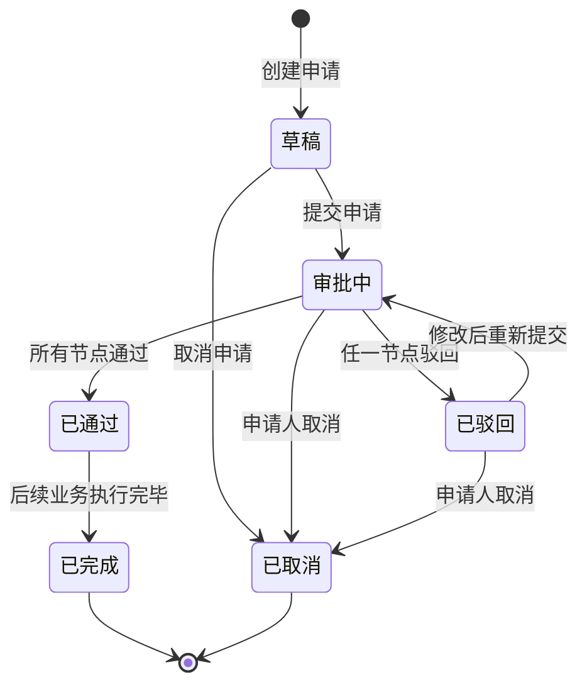
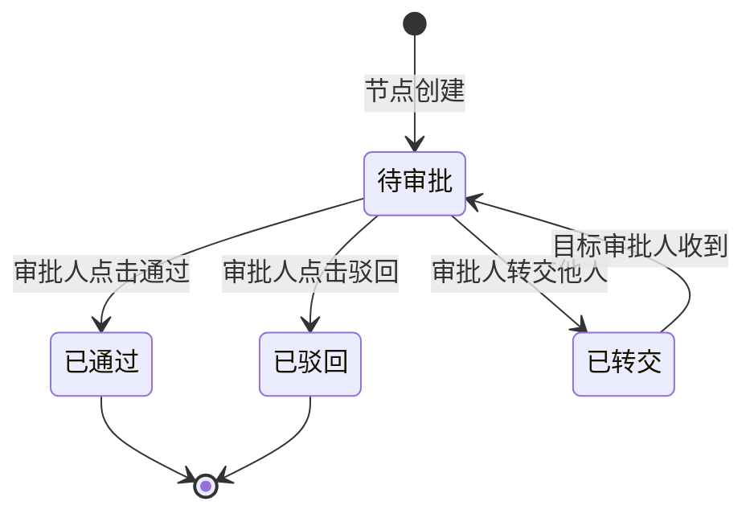
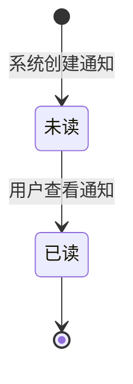

# 状态机图

**步骤**: 5/6
**状态**: completed
**自检**: 未检查

---

## 状态机图 1: 未命名

**描述**: 审批申请从创建到完成或取消的完整生命周期，包含草稿、审批中、已通过、已驳回、已取消、已完成六种状态

---

## 状态机图 2: 未命名

**描述**: 审批节点实例的生命周期，从创建到最终处理完成，包含待审批、已通过、已驳回、已转交四种状态

---

## 状态机图 3: 未命名

**描述**: 通知从创建到被用户阅读的生命周期，包含未读和已读两种状态

---

