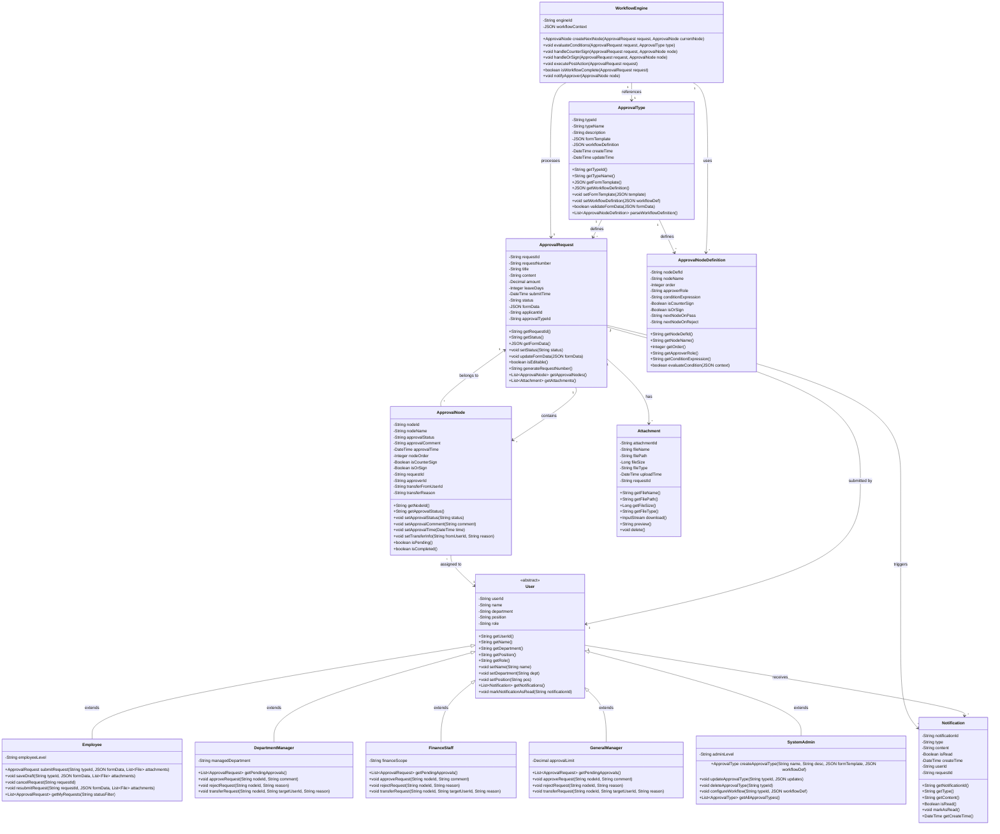

# 设计类图

**步骤**: 6/6
**状态**: completed
**自检**: 未检查

---

**设计摘要**: 设计类图在领域模型的基础上进行了细化，主要改进包括：
1. 将User类设为抽象类，定义了公共属性和方法，子类继承并扩展特定角色行为
2. 补充了每个类的完整方法签名，包括业务方法和getter/setter
3. 添加了可见性修饰符（public/private/protected），private属性通过public方法访问
4. 新增了ApprovalNodeDefinition类，用于表示审批类型中定义的节点模板，与WorkflowEngine协作驱动流程
5. 完善了所有关联关系的多重性约束
6. 方法命名遵循驼峰命名规范，参数类型使用泛型（如List~File~）和JSON类型表示复杂数据结构

## Mermaid 设计类图

