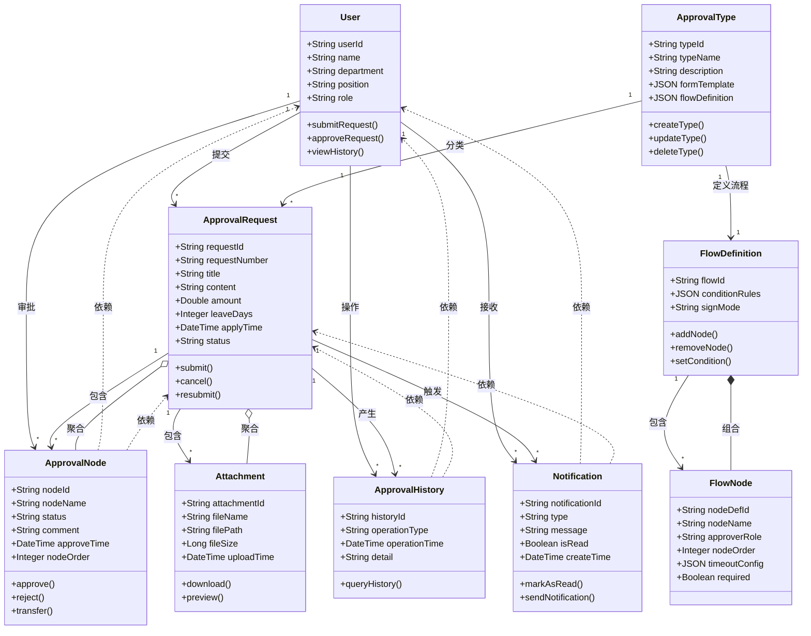

# 领域模型

**步骤**: 4/6
**状态**: completed
**自检**: 未检查

---

## Mermaid 类图

## 类关系

- **User** 关联 **ApprovalRequest** (1对多)
- **User** 关联 **ApprovalNode** (1对多)
- **User** 关联 **ApprovalHistory** (1对多)
- **User** 关联 **Notification** (1对多)
- **ApprovalType** 关联 **ApprovalRequest** (1对多)
- **ApprovalType** 关联 **FlowDefinition** (1对1)
- **ApprovalRequest** 聚合 **ApprovalNode** (1对多)
- **ApprovalRequest** 聚合 **Attachment** (1对多)
- **FlowDefinition** 组合 **FlowNode** (1对多)
- **ApprovalRequest** 关联 **ApprovalHistory** (1对多)
- **ApprovalRequest** 关联 **Notification** (1对多)
- **ApprovalNode** 依赖 **User** (多对1)
- **ApprovalNode** 依赖 **ApprovalRequest** (多对1)
- **ApprovalHistory** 依赖 **User** (多对1)
- **ApprovalHistory** 依赖 **ApprovalRequest** (多对1)
- **Notification** 依赖 **User** (多对1)
- **Notification** 依赖 **ApprovalRequest** (多对1)

