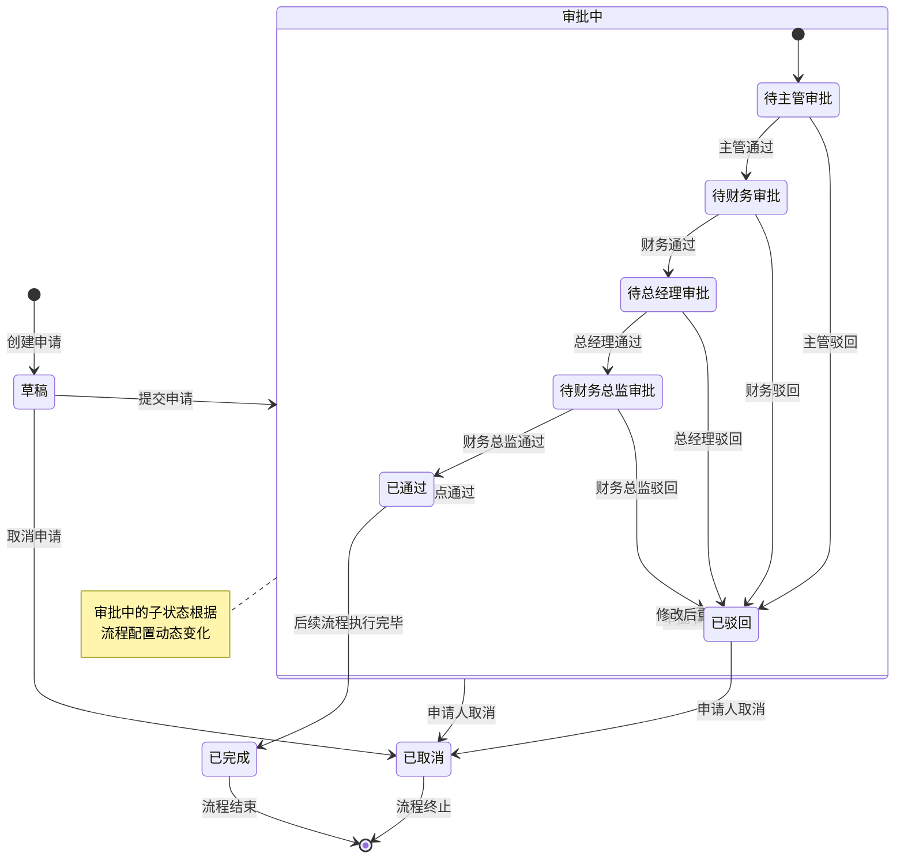

# 状态机图

**步骤**: 5/6
**状态**: completed
**自检**: 未检查

---

## 状态机图 1: 未命名

**描述**: 审批申请的生命周期，从创建到最终完成或取消的完整状态转换过程



---

## 状态机图 2: 未命名

**描述**: 审批节点实例的状态转换，描述单个审批节点的处理过程

```mermaid
stateDiagram-v2
    [*] --> 待审批 : 节点创建
    待审批 --> 通过 : 审批人通过
    待审批 --> 驳回 : 审批人驳回
    待审批 --> 转交中 : 审批人转交
    转交中 --> 待审批 : 转交成功
    转交中 --> 待审批 : 转交失败退回
    通过 --> [*] : 节点完成
    驳回 --> [*] : 节点终止

    state 转交中 {
        [*] --> 选择目标审批人
        选择目标审批人 --> 确认转交
        确认转交 --> 转交成功
        确认转交 --> 转交失败
        转交成功 --> [*]
        转交失败 --> 选择目标审批人 : 重新选择
    end note
```

---

## 状态机图 3: 未命名

**描述**: 通知消息的生命周期，从创建到被用户处理的状态变化

```mermaid
stateDiagram-v2
    [*] --> 未发送 : 通知创建
    未发送 --> 已发送 : 系统推送
    已发送 --> 已读 : 用户查看
    已发送 --> 已过期 : 超过有效期
    已读 --> [*] : 通知完成
    已过期 --> [*] : 通知失效

    state 已发送 {
        [*] --> 待处理
        待处理 --> 已处理 : 用户点击链接
        待处理 --> 已忽略 : 用户忽略
    end note
```

---

