# 设计类图

**步骤**: 6/6
**状态**: completed
**自检**: 未检查

---

**设计摘要**: 设计类图在领域模型基础上进行了细化，共包含11个类。主要改进包括：1) 为每个类添加了完整的属性和方法，包括构造方法、getter/setter和业务方法；2) 明确了属性和方法的可见性（private属性、public方法）；3) 新增了WorkflowEngine（工作流引擎，采用单例模式）、FormValidator（表单验证器）和ValidationResult（验证结果）三个设计类，用于处理核心业务流程和验证逻辑；4) 完善了类之间的关系，包括关联、聚合、组合和依赖关系；5) 为关键业务方法添加了参数和返回类型。这个设计类图可以直接作为后续编码实现的参考。

## Mermaid 设计类图

```mermaid
classDiagram
    class User {
        -String userId
        -String name
        -String department
        -String position
        -String role
        -String email
        -String phone
        +User(String userId, String name, String role)
        +getUserId() String
        +getName() String
        +getDepartment() String
        +getPosition() String
        +getRole() String
        +setDepartment(String department) void
        +setPosition(String position) void
        +submitRequest(ApprovalType type, Map~String, Object~ formData) ApprovalRequest
        +approveNode(ApprovalNode node, String action, String comment) boolean
        +transferNode(ApprovalNode node, User targetUser, String reason) boolean
        +viewPendingRequests() List~ApprovalRequest~
        +viewHistory() List~ApprovalHistory~
        +getNotifications() List~Notification~
    }

    class ApprovalType {
        -String typeId
        -String typeName
        -String description
        -JSONObject formTemplate
        -FlowDefinition flowDefinition
        -DateTime createTime
        -DateTime updateTime
        +ApprovalType(String typeName, JSONObject formTemplate)
        +getTypeId() String
        +getTypeName() String
        +getFormTemplate() JSONObject
        +getFlowDefinition() FlowDefinition
        +setFormTemplate(JSONObject template) void
        +setFlowDefinition(FlowDefinition flowDef) void
        +addFormField(String fieldName, String fieldType, boolean required) void
        +removeFormField(String fieldName) void
        +validateFormData(Map~String, Object~ formData) boolean
        +createRequest(User applicant, Map~String, Object~ formData) ApprovalRequest
    }

    class ApprovalRequest {
        -String requestId
        -String requestNumber
        -String title
        -String content
        -double amount
        -int leaveDays
        -DateTime applyTime
        -String status
        -User applicant
        -ApprovalType approvalType
        -List~ApprovalNode~ nodes
        -List~Attachment~ attachments
        -List~ApprovalHistory~ histories
        +ApprovalRequest(User applicant, ApprovalType type)
        +getRequestId() String
        +getRequestNumber() String
        +getStatus() String
        +getApplicant() User
        +getApprovalType() ApprovalType
        +getNodes() List~ApprovalNode~
        +getAttachments() List~Attachment~
        +submit() boolean
        +cancel() boolean
        +resubmit() boolean
        +addNode(ApprovalNode node) void
        +addAttachment(Attachment attachment) void
        +getCurrentNode() ApprovalNode
        +getNextNode() ApprovalNode
        +isCompleted() boolean
        -generateRequestNumber() String
        -validateStatus(String expectedStatus) boolean
    }

    class ApprovalNode {
        -String nodeId
        -String nodeName
        -int nodeOrder
        -String status
        -String comment
        -DateTime approveTime
        -User approver
        -ApprovalRequest request
        -String transferReason
        -User transferFrom
        +ApprovalNode(String nodeName, int order, User approver, ApprovalRequest request)
        +getNodeId() String
        +getNodeName() String
        +getStatus() String
        +getApprover() User
        +getComment() String
        +approve(String comment) boolean
        +reject(String comment) boolean
        +transfer(User targetUser, String reason) boolean
        +isProcessed() boolean
        -validateApprover(User user) boolean
        -logOperation(String operationType, String detail) void
    }

    class Attachment {
        -String attachmentId
        -String fileName
        -String filePath
        -long fileSize
        -String fileType
        -DateTime uploadTime
        -User uploader
        -ApprovalRequest request
        +Attachment(String fileName, String filePath, User uploader)
        +getAttachmentId() String
        +getFileName() String
        +getFilePath() String
        +getFileSize() long
        +getFileType() String
        +download() InputStream
        +preview() String
        -validateFileType() boolean
        -validateFileSize() boolean
    }

    class FlowDefinition {
        -String flowId
        -String signMode
        -JSONObject conditionRules
        -List~FlowNode~ flowNodes
        -DateTime createTime
        -DateTime updateTime
        +FlowDefinition(String signMode)
        +getFlowId() String
        +getSignMode() String
        +getFlowNodes() List~FlowNode~
        +addFlowNode(FlowNode node) void
        +removeFlowNode(String nodeDefId) void
        +setConditionRules(JSONObject rules) void
        +getNextNode(FlowNode currentNode, ApprovalRequest request) FlowNode
        +getStartNode() FlowNode
        +validateFlow() boolean
        -checkCondition(JSONObject condition, ApprovalRequest request) boolean
    }

    class FlowNode {
        -String nodeDefId
        -String nodeName
        -String approverRole
        -int nodeOrder
        -JSONObject timeoutConfig
        -boolean required
        -List~String~ conditionExpressions
        +FlowNode(String nodeName, String approverRole, int order)
        +getNodeDefId() String
        +getNodeName() String
        +getApproverRole() String
        +getNodeOrder() int
        +isRequired() boolean
        +setRequired(boolean required) void
        +setTimeoutConfig(JSONObject config) void
        +addCondition(String expression) void
        +removeCondition(String expression) void
        +evaluateCondition(ApprovalRequest request) boolean
        +createInstance(ApprovalRequest request, User approver) ApprovalNode
    }

    class ApprovalHistory {
        -String historyId
        -String operationType
        -String detail
        -DateTime operationTime
        -User operator
        -ApprovalRequest request
        -ApprovalNode node
        +ApprovalHistory(User operator, ApprovalRequest request, String operationType, String detail)
        +getHistoryId() String
        +getOperationType() String
        +getDetail() String
        +getOperationTime() DateTime
        +getOperator() User
        +getRequest() ApprovalRequest
        +getNode() ApprovalNode
        +toString() String
    }

    class Notification {
        -String notificationId
        -String type
        -String title
        -String message
        -boolean isRead
        -DateTime createTime
        -DateTime readTime
        -User receiver
        -ApprovalRequest request
        +Notification(User receiver, ApprovalRequest request, String type, String message)
        +getNotificationId() String
        +getType() String
        +getTitle() String
        +getMessage() String
        +isRead() boolean
        +getReceiver() User
        +getRequest() ApprovalRequest
        +markAsRead() boolean
        +send() boolean
        -validateReceiver() boolean
    }

    class WorkflowEngine {
        -WorkflowEngine instance
        -WorkflowEngine()
        +getInstance() WorkflowEngine
        +startProcess(ApprovalRequest request) boolean
        +processNode(ApprovalNode node, String action, String comment) boolean
        +transferNode(ApprovalNode node, User targetUser, String reason) boolean
        +cancelProcess(ApprovalRequest request) boolean
        +resubmitProcess(ApprovalRequest request) boolean
        -getNextApprover(FlowNode flowNode, ApprovalRequest request) User
        -executePostProcess(ApprovalRequest request) boolean
        -sendNotification(User user, ApprovalRequest request, String type) void
        -createHistory(ApprovalRequest request, User operator, String operationType, String detail) void
    }

    class FormValidator {
        -FormValidator()
        +validate(JSONObject template, Map~String, Object~ formData) ValidationResult
        +validateField(String fieldName, Object value, JSONObject fieldConfig) boolean
        -validateRequired(Object value, boolean required) boolean
        -validateType(Object value, String expectedType) boolean
        -validateLength(String value, int min, int max) boolean
        -validateRange(double value, double min, double max) boolean
    }

    class ValidationResult {
        -boolean isValid
        -List~String~ errors
        +ValidationResult()
        +isValid() boolean
        +getErrors() List~String~
        +addError(String error) void
        +addErrors(List~String~ errors) void
    }

    %% 关联关系
    User "1" --> "*" ApprovalRequest : 提交
    User "1" --> "*" ApprovalNode : 审批
    User "1" --> "*" ApprovalHistory : 操作
    User "1" --> "*" Notification : 接收
    User "1" --> "*" Attachment : 上传

    ApprovalType "1" --> "*" ApprovalRequest : 分类
    ApprovalType "1" --> "1" FlowDefinition : 定义流程

    ApprovalRequest "1" --> "*" ApprovalNode : 包含
    ApprovalRequest "1" --> "*" Attachment : 包含
    ApprovalRequest "1" --> "*" ApprovalHistory : 产生
    ApprovalRequest "1" --> "*" Notification : 触发

    FlowDefinition "1" --> "*" FlowNode : 包含

    ApprovalNode "*" --> "1" User : 审批人
    ApprovalNode "*" --> "1" ApprovalRequest : 所属申请

    %% 依赖关系
    WorkflowEngine ..> ApprovalRequest : 处理
    WorkflowEngine ..> ApprovalNode : 处理
    WorkflowEngine ..> Notification : 创建
    WorkflowEngine ..> ApprovalHistory : 创建

    FormValidator ..> ApprovalType : 验证表单
    FormValidator ..> ValidationResult : 返回结果

    ApprovalType ..> FormValidator : 使用

    %% 聚合关系
    ApprovalRequest o-- ApprovalNode : 聚合
    ApprovalRequest o-- Attachment : 聚合

    %% 组合关系
    FlowDefinition *-- FlowNode : 组合

    %% 单例模式
    WorkflowEngine <.. WorkflowEngine : 单例
```

