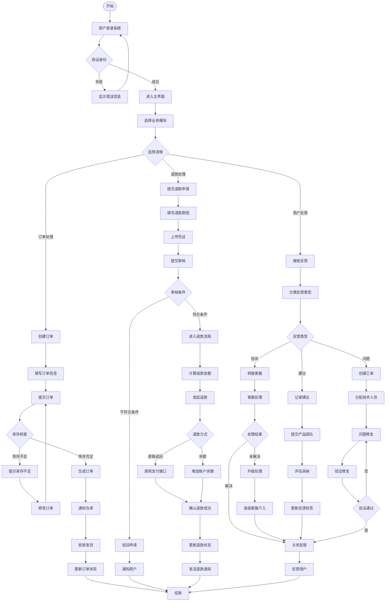

```mermaid
```mermaid
flowchart TD
    A([开始]) --> B[用户登录系统]
    B --> C{验证身份}
    C -->|失败| D[显示错误信息]
    D --> B
    C -->|成功| E[进入主界面]
    E --> F[选择业务模块]
    F --> G{选择流程}
    
    %% 流程1: 订单处理
    G -->|订单处理| H[创建订单]
    H --> I[填写订单信息]
    I --> J[提交订单]
    J --> K{库存检查}
    K -->|库存不足| L[提示库存不足]
    L --> M[修改订单]
    M --> J
    K -->|库存充足| N[生成订单]
    N --> O[通知仓库]
    O --> P[安排发货]
    P --> Q[更新订单状态]
    Q --> R[结束]
    
    %% 流程2: 退款处理
    G -->|退款处理| S[提交退款申请]
    S --> T[填写退款原因]
    T --> U[上传凭证]
    U --> V[提交审核]
    V --> W{审核条件}
    W -->|不符合条件| X[驳回申请]
    X --> Y[通知用户]
    Y --> R
    W -->|符合条件| Z[进入退款流程]
    Z --> AA[计算退款金额]
    AA --> AB[发起退款]
    AB --> AC{退款方式}
    AC -->|原路返回| AD[调用支付接口]
    AC -->|余额| AE[增加账户余额]
    AD --> AF[确认退款成功]
    AE --> AF
    AF --> AG[更新退款状态]
    AG --> AH[发送退款通知]
    AH --> R
    
    %% 流程3: 用户反馈处理
    G -->|用户反馈| AI[接收反馈]
    AI --> AJ[分类反馈类型]
    AJ --> AK{反馈类型}
    AK -->|投诉| AL[转接客服]
    AK -->|建议| AM[记录建议]
    AK -->|问题| AN[创建工单]
    AL --> AO[客服处理]
    AO --> AP{处理结果}
    AP -->|解决| AQ[关闭反馈]
    AP -->|未解决| AR[升级处理]
    AR --> AS[高级客服介入]
    AS --> AQ
    AM --> AT[提交产品团队]
    AT --> AU[评估采纳]
    AU --> AV[更新反馈状态]
    AV --> AQ
    AN --> AW[分配技术人员]
    AW --> AX[问题修复]
    AX --> AY[验证修复]
    AY --> AZ{验证通过}
    AZ -->|是| AQ
    AZ -->|否| AX
    AQ --> BA[反馈用户]
    BA --> R
```
```