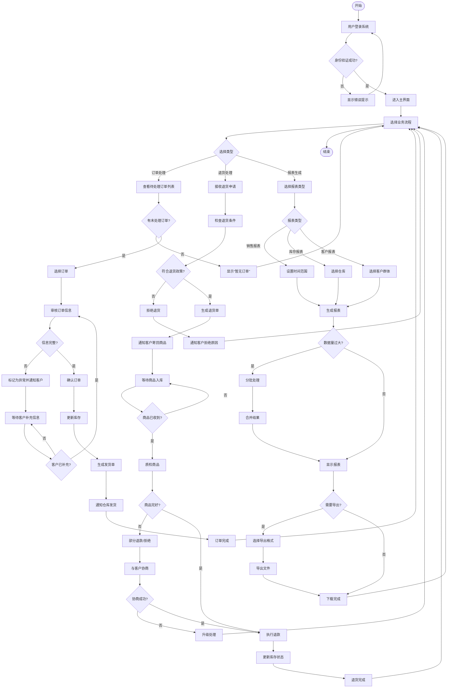

# 活动图

**步骤**: 2/6
**状态**: completed
**自检**: 未检查

---

**描述**: 该活动图描述了三个核心业务流程：1) 订单处理流程：从用户登录、身份验证、查看待处理订单、审核信息、确认订单到发货完成，包含信息完整性和客户补充信息的循环判断；2) 退货处理流程：从接收退货申请、检查退货条件、质检商品到执行退款或拒绝，包含商品入库等待和协商升级的循环分支；3) 报表生成流程：根据报表类型设置不同参数，处理大数据量时的分批合并，以及导出选项。所有流程均通过主界面选择进入，并最终返回主界面或结束。

## Mermaid 活动图


```

