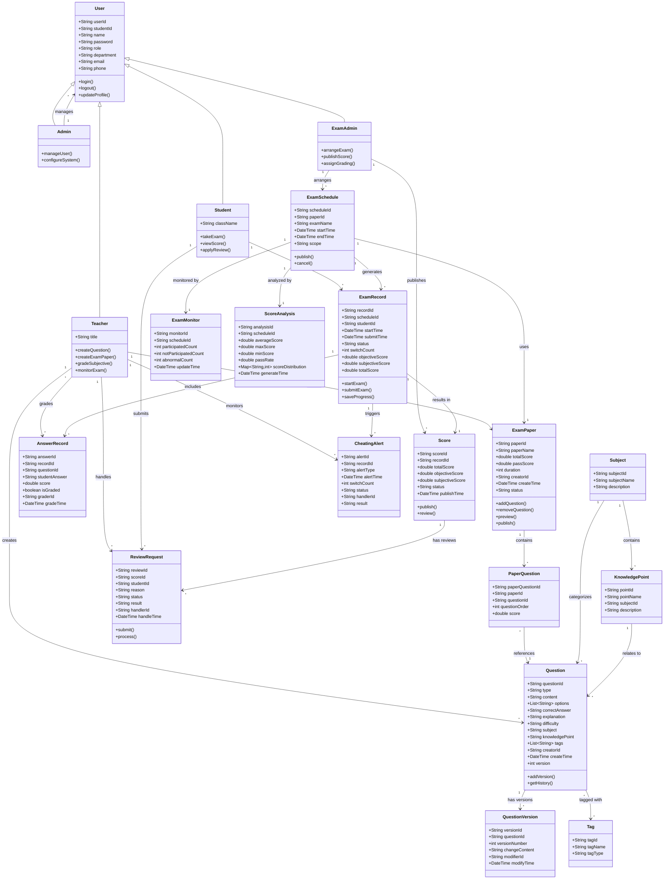

# 领域模型

**步骤**: 4/6
**状态**: completed
**自检**: 未检查

---

## Mermaid 类图

## 类关系详情

### 继承（泛化）

**描述**: User是基类，Student、Teacher、Admin、ExamAdmin是子类，继承User的基本属性，并拥有各自的特定行为

### 组合（Composition）

**描述**: 强拥有关系，子类生命周期依赖于父类

### 聚合（Aggregation）

**描述**: 弱拥有关系，子类可独立存在

### 关联（Association）

**描述**: 类之间的引用关系，无生命周期依赖

