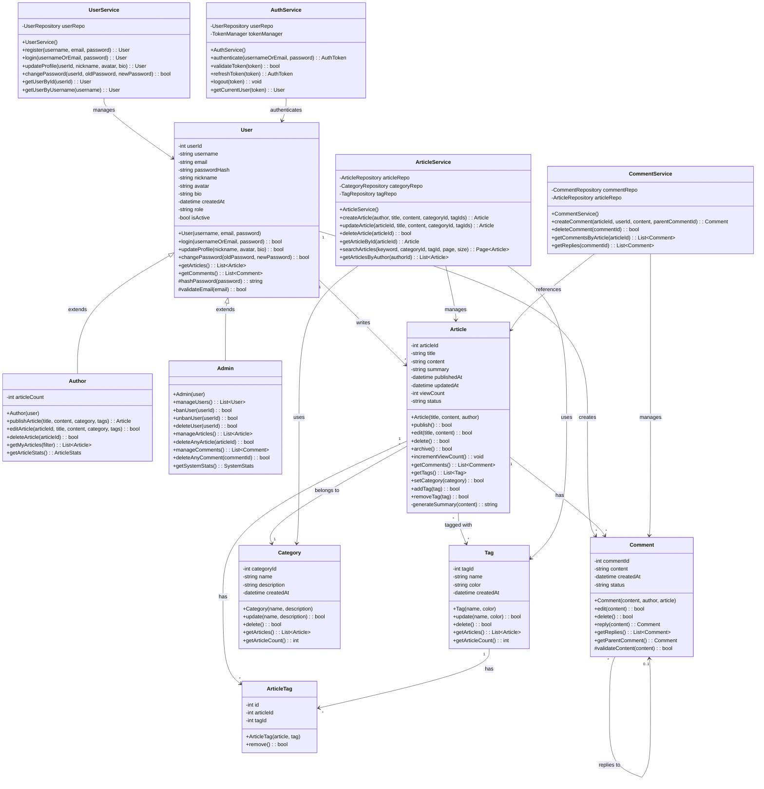

```mermaid
classDiagram
    class User {
        -int userId
        -string username
        -string email
        -string passwordHash
        -string nickname
        -string avatar
        -string bio
        -datetime createdAt
        -string role
        -bool isActive
        +User(username, email, password)
        +login(usernameOrEmail, password): bool
        +updateProfile(nickname, avatar, bio): bool
        +changePassword(oldPassword, newPassword): bool
        +getArticles(): List~Article~
        +getComments(): List~Comment~
        #hashPassword(password): string
        #validateEmail(email): bool
    }

    class Author {
        -int articleCount
        +Author(user)
        +publishArticle(title, content, category, tags): Article
        +editArticle(articleId, title, content, category, tags): bool
        +deleteArticle(articleId): bool
        +getMyArticles(filter): List~Article~
        +getArticleStats(): ArticleStats
    }

    class Admin {
        +Admin(user)
        +manageUsers(): List~User~
        +banUser(userId): bool
        +unbanUser(userId): bool
        +deleteUser(userId): bool
        +manageArticles(): List~Article~
        +deleteAnyArticle(articleId): bool
        +manageComments(): List~Comment~
        +deleteAnyComment(commentId): bool
        +getSystemStats(): SystemStats
    }

    class Article {
        -int articleId
        -string title
        -string content
        -string summary
        -datetime publishedAt
        -datetime updatedAt
        -int viewCount
        -string status
        +Article(title, content, author)
        +publish(): bool
        +edit(title, content): bool
        +delete(): bool
        +archive(): bool
        +incrementViewCount(): void
        +getComments(): List~Comment~
        +getTags(): List~Tag~
        +setCategory(category): bool
        +addTag(tag): bool
        +removeTag(tag): bool
        -generateSummary(content): string
    }

    class Comment {
        -int commentId
        -string content
        -datetime createdAt
        -string status
        +Comment(content, author, article)
        +edit(content): bool
        +delete(): bool
        +reply(content): Comment
        +getReplies(): List~Comment~
        +getParentComment(): Comment
        #validateContent(content): bool
    }

    class Category {
        -int categoryId
        -string name
        -string description
        -datetime createdAt
        +Category(name, description)
        +update(name, description): bool
        +delete(): bool
        +getArticles(): List~Article~
        +getArticleCount(): int
    }

    class Tag {
        -int tagId
        -string name
        -string color
        -datetime createdAt
        +Tag(name, color)
        +update(name, color): bool
        +delete(): bool
        +getArticles(): List~Article~
        +getArticleCount(): int
    }

    class ArticleTag {
        -int id
        -int articleId
        -int tagId
        +ArticleTag(article, tag)
        +remove(): bool
    }

    class ArticleService {
        -ArticleRepository articleRepo
        -CategoryRepository categoryRepo
        -TagRepository tagRepo
        +ArticleService()
        +createArticle(author, title, content, categoryId, tagIds): Article
        +updateArticle(articleId, title, content, categoryId, tagIds): Article
        +deleteArticle(articleId): bool
        +getArticleById(articleId): Article
        +searchArticles(keyword, categoryId, tagId, page, size): Page~Article~
        +getArticlesByAuthor(authorId): List~Article~
    }

    class CommentService {
        -CommentRepository commentRepo
        -ArticleRepository articleRepo
        +CommentService()
        +createComment(articleId, userId, content, parentCommentId): Comment
        +deleteComment(commentId): bool
        +getCommentsByArticle(articleId): List~Comment~
        +getReplies(commentId): List~Comment~
    }

    class UserService {
        -UserRepository userRepo
        +UserService()
        +register(username, email, password): User
        +login(usernameOrEmail, password): User
        +updateProfile(userId, nickname, avatar, bio): User
        +changePassword(userId, oldPassword, newPassword): bool
        +getUserById(userId): User
        +getUserByUsername(username): User
    }

    class AuthService {
        -UserRepository userRepo
        -TokenManager tokenManager
        +AuthService()
        +authenticate(usernameOrEmail, password): AuthToken
        +validateToken(token): bool
        +refreshToken(token): AuthToken
        +logout(token): void
        +getCurrentUser(token): User
    }

    User <|-- Author : extends
    User <|-- Admin : extends
    User "1" --> "*" Article : writes
    User "1" --> "*" Comment : creates
    Article "1" --> "*" Comment : has
    Article "*" --> "1" Category : belongs to
    Article "*" --> "*" Tag : tagged with
    Article "1" --> "*" ArticleTag : has
    Tag "1" --> "*" ArticleTag : has
    Comment "*" --> "0..1" Comment : replies to
    ArticleService --> Article : manages
    ArticleService --> Category : uses
    ArticleService --> Tag : uses
    CommentService --> Comment : manages
    CommentService --> Article : references
    UserService --> User : manages
    AuthService --> User : authenticates
```