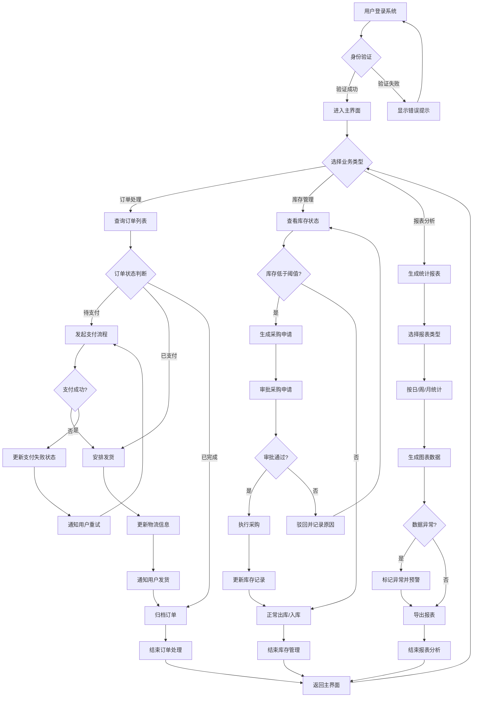

```mermaid
flowchart TD
    A[用户登录系统] --> B{身份验证}
    B -- 验证成功 --> C[进入主界面]
    B -- 验证失败 --> D[显示错误提示]
    D --> A
    C --> E{选择业务类型}
    E -- 订单处理 --> F[查询订单列表]
    E -- 库存管理 --> G[查看库存状态]
    E -- 报表分析 --> H[生成统计报表]
    F --> I{订单状态判断}
    I -- 待支付 --> J[发起支付流程]
    I -- 已支付 --> K[安排发货]
    I -- 已完成 --> L[归档订单]
    J --> M{支付成功?}
    M -- 是 --> K
    M -- 否 --> N[更新支付失败状态]
    N --> O[通知用户重试]
    O --> J
    K --> P[更新物流信息]
    P --> Q[通知用户发货]
    Q --> L
    L --> R[结束订单处理]
    G --> S{库存低于阈值?}
    S -- 是 --> T[生成采购申请]
    S -- 否 --> U[正常出库/入库]
    T --> V[审批采购申请]
    V --> W{审批通过?}
    W -- 是 --> X[执行采购]
    W -- 否 --> Y[驳回并记录原因]
    Y --> G
    X --> Z[更新库存记录]
    Z --> U
    U --> AA[结束库存管理]
    H --> AB[选择报表类型]
    AB --> AC[按日/周/月统计]
    AC --> AD[生成图表数据]
    AD --> AE{数据异常?}
    AE -- 是 --> AF[标记异常并预警]
    AE -- 否 --> AG[导出报表]
    AF --> AG
    AG --> AH[结束报表分析]
    R --> AI[返回主界面]
    AA --> AI
    AH --> AI
    AI --> E
```