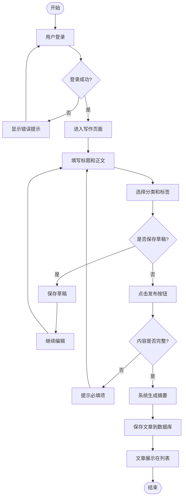
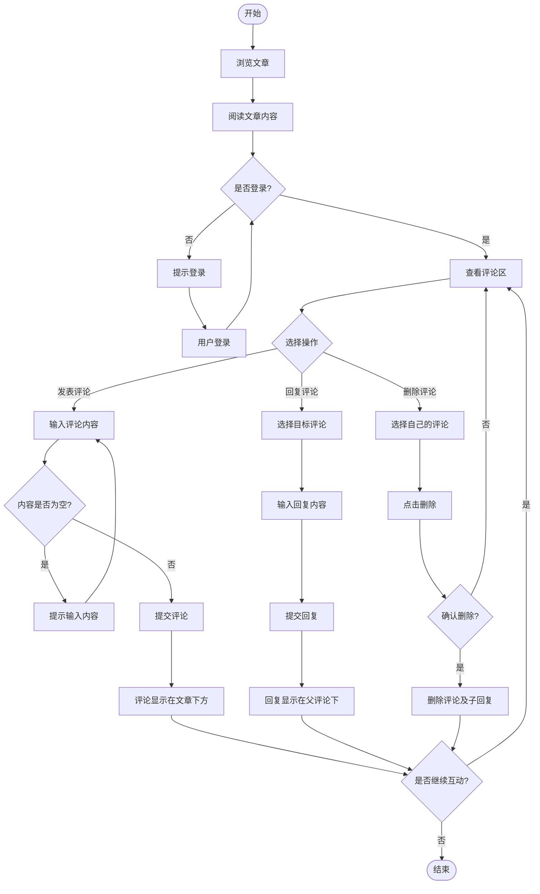
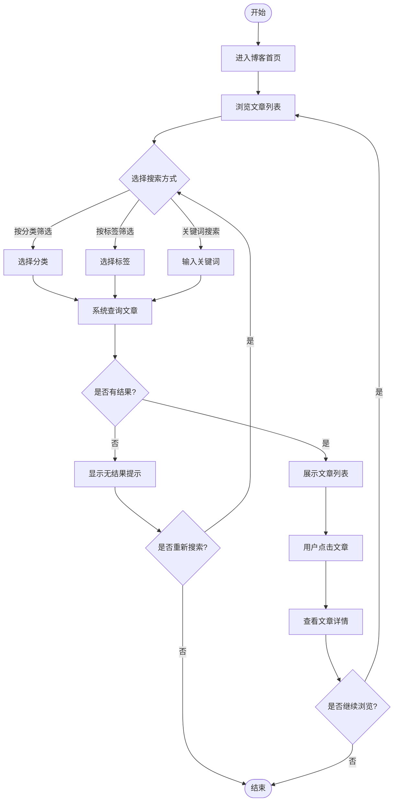

```mermaid
flowchart TD
    A([开始]) --> B[用户登录]
    B --> C{登录成功?}
    C -->|否| D[显示错误提示]
    D --> B
    C -->|是| E[进入写作页面]
    E --> F[填写标题和正文]
    F --> G[选择分类和标签]
    G --> H{是否保存草稿?}
    H -->|是| I[保存草稿]
    I --> J[继续编辑]
    J --> F
    H -->|否| K[点击发布按钮]
    K --> L{内容是否完整?}
    L -->|否| M[提示必填项]
    M --> F
    L -->|是| N[系统生成摘要]
    N --> O[保存文章到数据库]
    O --> P[文章展示在列表]
    P --> Q([结束])
```

---

```mermaid
flowchart TD
    A([开始]) --> B[浏览文章]
    B --> C[阅读文章内容]
    C --> D{是否登录?}
    D -->|否| E[提示登录]
    E --> F[用户登录]
    F --> D
    D -->|是| G[查看评论区]
    G --> H{选择操作}
    H -->|发表评论| I[输入评论内容]
    I --> J{内容是否为空?}
    J -->|是| K[提示输入内容]
    K --> I
    J -->|否| L[提交评论]
    L --> M[评论显示在文章下方]
    M --> N{是否继续互动?}
    H -->|回复评论| O[选择目标评论]
    O --> P[输入回复内容]
    P --> Q[提交回复]
    Q --> R[回复显示在父评论下]
    R --> N
    H -->|删除评论| S[选择自己的评论]
    S --> T[点击删除]
    T --> U{确认删除?}
    U -->|否| G
    U -->|是| V[删除评论及子回复]
    V --> N
    N -->|是| G
    N -->|否| W([结束])
```

---

```mermaid
flowchart TD
    A([开始]) --> B[进入博客首页]
    B --> C[浏览文章列表]
    C --> D{选择搜索方式}
    D -->|按分类筛选| E[选择分类]
    D -->|按标签筛选| F[选择标签]
    D -->|关键词搜索| G[输入关键词]
    E --> H[系统查询文章]
    F --> H
    G --> H
    H --> I{是否有结果?}
    I -->|否| J[显示无结果提示]
    J --> K{是否重新搜索?}
    K -->|是| D
    K -->|否| L([结束])
    I -->|是| M[展示文章列表]
    M --> N[用户点击文章]
    N --> O[查看文章详情]
    O --> P{是否继续浏览?}
    P -->|是| C
    P -->|否| L
```