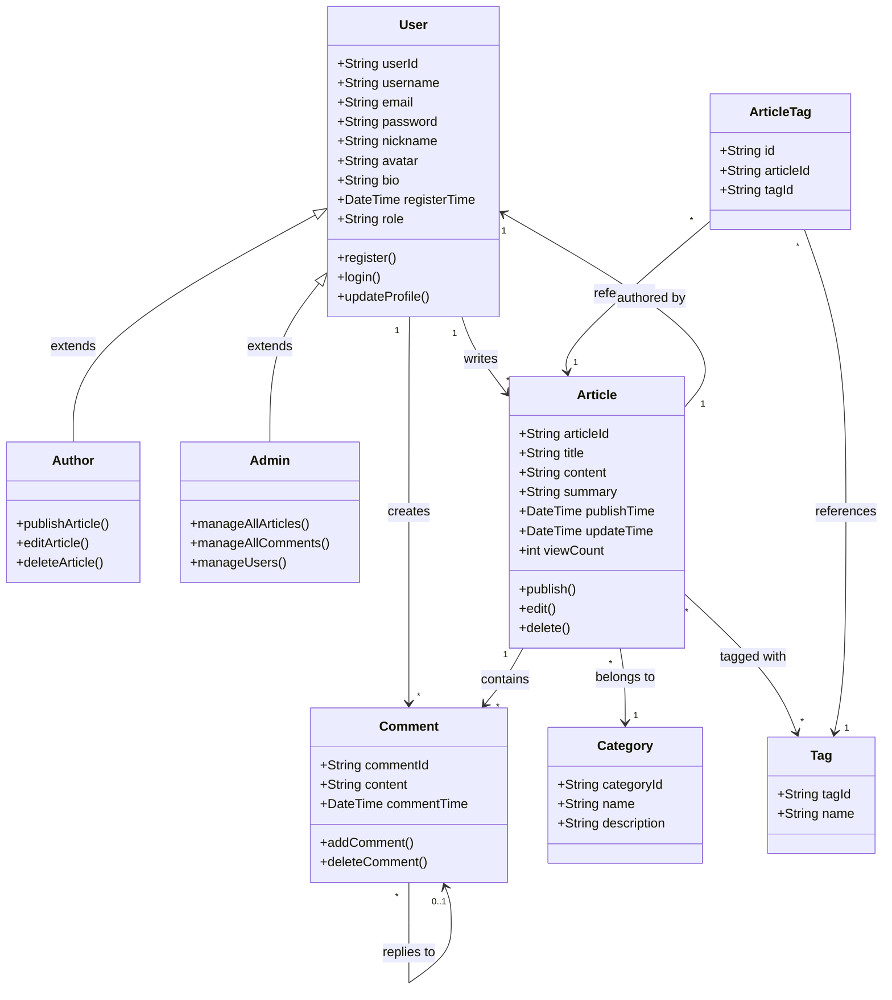

# 领域模型

**步骤**: 4/6
**状态**: completed
**自检**: 未检查

---

## Mermaid 类图

## 类关系

- **undefined** 泛化（继承） **undefined**
- **undefined** 关联 **undefined**
- **undefined** 聚合/组合 **undefined**
- **undefined** 多重性约束 **undefined**

