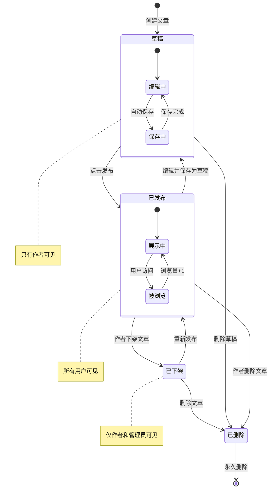
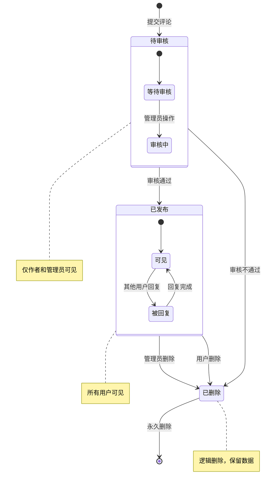
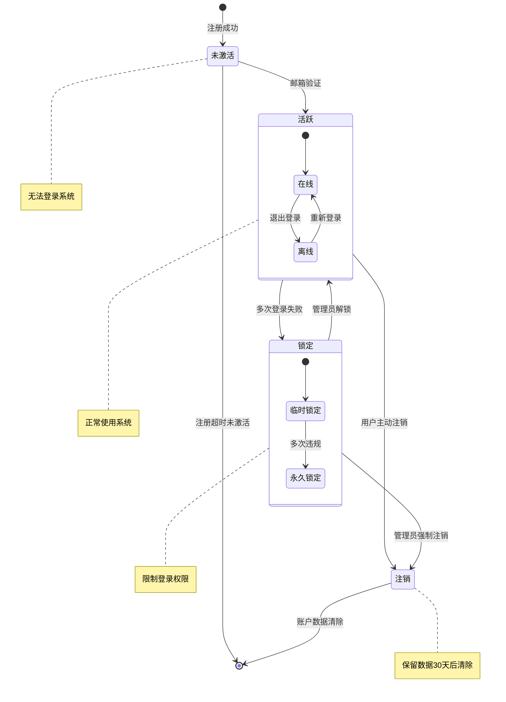

```mermaid
stateDiagram-v2
    [*] --> 草稿 : 创建文章
    草稿 --> 已发布 : 点击发布
    草稿 --> 已删除 : 删除草稿
    已发布 --> 草稿 : 编辑并保存为草稿
    已发布 --> 已下架 : 作者下架文章
    已发布 --> 已删除 : 作者删除文章
    已下架 --> 已发布 : 重新发布
    已下架 --> 已删除 : 删除文章
    已删除 --> [*] : 永久删除
    
    state 草稿 {
        [*] --> 编辑中
        编辑中 --> 保存中 : 自动保存
        保存中 --> 编辑中 : 保存完成
    }
    
    state 已发布 {
        [*] --> 展示中
        展示中 --> 被浏览 : 用户访问
        被浏览 --> 展示中 : 浏览量+1
    }
    
    note right of 草稿 : 只有作者可见
    note right of 已发布 : 所有用户可见
    note right of 已下架 : 仅作者和管理员可见
```

---

```mermaid
stateDiagram-v2
    [*] --> 待审核 : 提交评论
    待审核 --> 已发布 : 审核通过
    待审核 --> 已删除 : 审核不通过
    已发布 --> 已删除 : 用户删除
    已发布 --> 已删除 : 管理员删除
    已删除 --> [*] : 永久删除
    
    state 待审核 {
        [*] --> 等待审核
        等待审核 --> 审核中 : 管理员操作
    }
    
    state 已发布 {
        [*] --> 可见
        可见 --> 被回复 : 其他用户回复
        被回复 --> 可见 : 回复完成
    }
    
    note right of 待审核 : 仅作者和管理员可见
    note right of 已发布 : 所有用户可见
    note right of 已删除 : 逻辑删除，保留数据
```

---

```mermaid
stateDiagram-v2
    [*] --> 未激活 : 注册成功
    未激活 --> 活跃 : 邮箱验证
    未激活 --> [*] : 注册超时未激活
    活跃 --> 锁定 : 多次登录失败
    活跃 --> 注销 : 用户主动注销
    锁定 --> 活跃 : 管理员解锁
    锁定 --> 注销 : 管理员强制注销
    注销 --> [*] : 账户数据清除
    
    state 活跃 {
        [*] --> 在线
        在线 --> 离线 : 退出登录
        离线 --> 在线 : 重新登录
    }
    
    state 锁定 {
        [*] --> 临时锁定
        临时锁定 --> 永久锁定 : 多次违规
    }
    
    note right of 未激活 : 无法登录系统
    note right of 活跃 : 正常使用系统
    note right of 锁定 : 限制登录权限
    note right of 注销 : 保留数据30天后清除
```