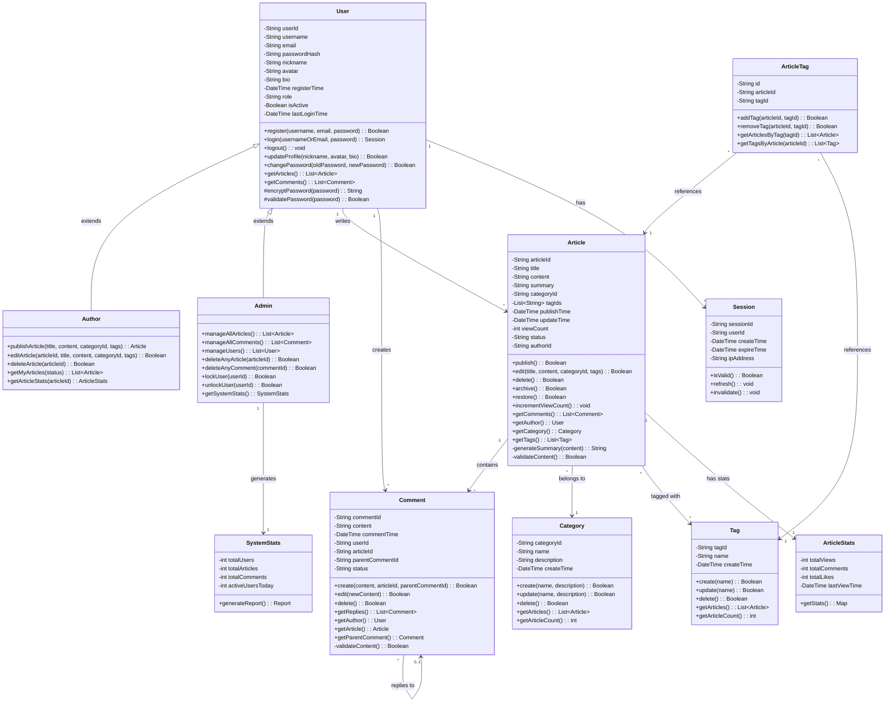

```mermaid
classDiagram
    class User {
        -String userId
        -String username
        -String email
        -String passwordHash
        -String nickname
        -String avatar
        -String bio
        -DateTime registerTime
        -String role
        -Boolean isActive
        -DateTime lastLoginTime
        +register(username, email, password): Boolean
        +login(usernameOrEmail, password): Session
        +logout(): void
        +updateProfile(nickname, avatar, bio): Boolean
        +changePassword(oldPassword, newPassword): Boolean
        +getArticles(): List~Article~
        +getComments(): List~Comment~
        #encryptPassword(password): String
        #validatePassword(password): Boolean
    }

    class Author {
        +publishArticle(title, content, categoryId, tags): Article
        +editArticle(articleId, title, content, categoryId, tags): Boolean
        +deleteArticle(articleId): Boolean
        +getMyArticles(status): List~Article~
        +getArticleStats(articleId): ArticleStats
    }

    class Admin {
        +manageAllArticles(): List~Article~
        +manageAllComments(): List~Comment~
        +manageUsers(): List~User~
        +deleteAnyArticle(articleId): Boolean
        +deleteAnyComment(commentId): Boolean
        +lockUser(userId): Boolean
        +unlockUser(userId): Boolean
        +getSystemStats(): SystemStats
    }

    class Article {
        -String articleId
        -String title
        -String content
        -String summary
        -String categoryId
        -List~String~ tagIds
        -DateTime publishTime
        -DateTime updateTime
        -int viewCount
        -String status
        -String authorId
        +publish(): Boolean
        +edit(title, content, categoryId, tags): Boolean
        +delete(): Boolean
        +archive(): Boolean
        +restore(): Boolean
        +incrementViewCount(): void
        +getComments(): List~Comment~
        +getAuthor(): User
        +getCategory(): Category
        +getTags(): List~Tag~
        -generateSummary(content): String
        -validateContent(): Boolean
    }

    class Comment {
        -String commentId
        -String content
        -DateTime commentTime
        -String userId
        -String articleId
        -String parentCommentId
        -String status
        +create(content, articleId, parentCommentId): Boolean
        +edit(newContent): Boolean
        +delete(): Boolean
        +getReplies(): List~Comment~
        +getAuthor(): User
        +getArticle(): Article
        +getParentComment(): Comment
        -validateContent(): Boolean
    }

    class Category {
        -String categoryId
        -String name
        -String description
        -DateTime createTime
        +create(name, description): Boolean
        +update(name, description): Boolean
        +delete(): Boolean
        +getArticles(): List~Article~
        +getArticleCount(): int
    }

    class Tag {
        -String tagId
        -String name
        -DateTime createTime
        +create(name): Boolean
        +update(name): Boolean
        +delete(): Boolean
        +getArticles(): List~Article~
        +getArticleCount(): int
    }

    class ArticleTag {
        -String id
        -String articleId
        -String tagId
        +addTag(articleId, tagId): Boolean
        +removeTag(articleId, tagId): Boolean
        +getArticlesByTag(tagId): List~Article~
        +getTagsByArticle(articleId): List~Tag~
    }

    class Session {
        -String sessionId
        -String userId
        -DateTime createTime
        -DateTime expireTime
        -String ipAddress
        +isValid(): Boolean
        +refresh(): void
        +invalidate(): void
    }

    class ArticleStats {
        -int totalViews
        -int totalComments
        -int totalLikes
        -DateTime lastViewTime
        +getStats(): Map
    }

    class SystemStats {
        -int totalUsers
        -int totalArticles
        -int totalComments
        -int activeUsersToday
        +generateReport(): Report
    }

    User <|-- Author : extends
    User <|-- Admin : extends
    User "1" --> "*" Article : writes
    User "1" --> "*" Comment : creates
    User "1" --> "*" Session : has
    Article "1" --> "*" Comment : contains
    Article "*" --> "1" Category : belongs to
    Article "*" --> "*" Tag : tagged with
    ArticleTag "*" --> "1" Article : references
    ArticleTag "*" --> "1" Tag : references
    Comment "*" --> "0..1" Comment : replies to
    Article "1" --> "1" ArticleStats : has stats
    Admin "1" --> "1" SystemStats : generates
```